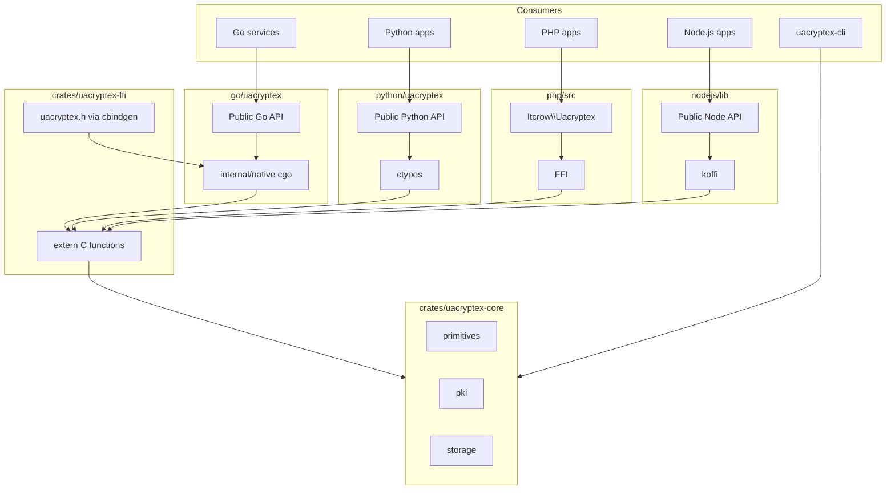

# uacryptex — Architecture

> **Languages:** English · [Українська](uk/ARCHITECTURE.md)

## Goals

1. **Pure Rust core** — memory-safe implementation of Ukrainian crypto standards and PKI.
2. **Language bindings** — idiomatic APIs for Go, Python, PHP, and Node.js.
3. **Stable C ABI** — thin FFI layer (`uacryptex-ffi`) for all bindings.
4. **Cross-platform** — prebuilt native artifacts via CI matrix (linux/darwin/windows × amd64/arm64).

Cryptonite C sources under `../cryptonite/` remain the **KAT oracle** during migration, not a runtime dependency.

## Layer diagram



## Crate responsibilities

### `uacryptex-core`

Pure Rust. Business logic lives here only.

```
uacryptex-core/src/
├── lib.rs
├── error.rs
├── oid.rs
├── primitives/
│   ├── mod.rs
│   ├── dstu4145/      # EC2M signatures (port from cryptonite)
│   ├── dstu7564/      # Kupyna (wrap kupyna crate + KMAC)
│   ├── dstu7624/      # Kalyna (port)
│   ├── gost28147/
│   └── gost3410/      # legacy GOST R 34.10-94 GF(p); feature legacy-gost3410
├── pki/
│   ├── mod.rs
│   ├── cert/
│   ├── cms/
│   ├── ocsp/
│   ├── tsp/
│   └── crl/
└── storage/
    ├── mod.rs
    ├── pkcs8/
    └── pkcs12/
```

**Dependencies:** RustCrypto (`aes`, `rsa`, `p256`, `cms`, `x509-cert`, `x509-ocsp`, `pkcs12`, `kupyna`, `gost-crypto`), `thiserror`, `zeroize`.

**Safety:** `#![forbid(unsafe_code)]` on crate root; localized `unsafe` only in math hot paths after audit.

### `uacryptex-ffi`

Thin adapter. No crypto logic — only:

- `repr(C)` types
- pointer / length marshalling
- `CryptoniteBuf` ownership (`cryptonited_buf_free`)
- error mapping to `UacryptexError`

Generate header: `cbindgen` → `include/uacryptex.h` → sync to `go/uacryptex/internal/native/`.

### Language bindings

All bindings share the same C ABI and memory rules. Set `UACRYPTEX_LIB` to override the default `native/lib/{os}/{arch}/` path.

| Language | Path | FFI mechanism | Public API |
|----------|------|---------------|------------|
| Go | `go/uacryptex/` | cgo | `LibraryVersion`, `OpenPKCS12`, `SignCMS`, `VerifyCMS`, `EnvelopCMS`, `DecryptCMS`, `PrivateKey` |
| Python | `python/uacryptex/` | ctypes | same surface (`library_version`, `open_pkcs12`, …) |
| PHP | `php/src/` | `ext-ffi` | `Uacryptex::libraryVersion()`, `openPkcs12()`, … |
| Node.js | `nodejs/lib/` | koffi | `libraryVersion()`, `openPkcs12()`, … |

### `go/uacryptex`

Public Go module. Hides cgo entirely.

| Go API | FFI entry (planned) |
|--------|---------------------|
| `Version()` | `uacryptex_version` |
| `OpenPKCS12()` | `uacryptex_pkcs12_open` |
| `VerifyCMS()` | `uacryptex_cms_verify` |
| `SignCMS()` | `uacryptex_cms_sign` |
| `PrivateKey.Sign()` | `uacryptex_sign_digest` |

## Memory ownership (FFI)

| Direction | Rule |
|-----------|------|
| Rust → Go | Out buffers as `UacryptexBuf { ptr, len }`; Go calls `uacryptex_buf_free` |
| Go → Rust | Borrowed slices for call duration only; copy if async needed |
| Handles | Opaque `uacryptex_handle_t` for keys/contexts; `uacryptex_handle_free` |

Never pass Rust struct layouts across the boundary.

## Cross-platform build

### Rust artifacts

```bash
./scripts/build-ffi.sh                    # host
./scripts/build-ffi.sh linux amd64        # explicit target
```

Outputs to `native/lib/{os}/{arch}/` then **`./scripts/sync-native-libs.sh`** copies into `go/native/lib/`, `python/uacryptex/native/lib/`, `php/native/lib/`, `nodejs/native/lib/`.

| Artifact | Location | Consumers |
|----------|----------|-----------|
| `libuacryptex_ffi.a` / `.lib` | `{os}/{arch}/` | Go cgo |
| shared `.so` / `.dylib` / `.dll` | `{os}/{arch}/shared/` | Python, PHP, Node.js |

Platforms: `linux`, `darwin`, `windows` × `amd64`, `arm64` — see `scripts/platforms.sh` and `.github/workflows/build-ffi.yml`.

### Go linking

Prebuilt libs in `native/lib/`. cgo `#cgo` directives select path by `GOOS`/`GOARCH`.

Consumers run `go get github.com/itcrow/uacryptex/...` without installing Rust.

### CI matrix

| Workflow | Purpose |
|----------|---------|
| `rust.yml` | `cargo test`, clippy, fmt |
| `build-ffi.yml` | matrix → upload `native/lib` artifacts |
| `go.yml` | download artifacts, `go test ./...` |

## Mapping from Cryptonite C modules

| Cryptonite C | uacryptex |
|--------------|-----------|
| `src/cryptonite/` | `uacryptex-core::primitives` |
| `src/asn1/` | `der` + RustCrypto formats (do not port asn1c) |
| `src/pkix/` | `uacryptex-core::pki` |
| `src/storage/` | `uacryptex-core::storage` |
| `src/pthread/` | `std::sync` (no separate crate) |
| Public C API | `uacryptex-ffi` (narrow surface, not 1:1) |

## Versioning

| Component | Scheme |
|-----------|--------|
| Rust crates | semver `0.x` |
| Go module | tag `go/v0.x` or root tag synced with Rust |
| FFI ABI | breaking change → major bump on both sides |

## Certification note

Replacing Cryptonite C with Rust requires a new Ukrainian state crypto expertise cycle (ДССЗЗІ). Plan compliance validation in Phase 6 of the roadmap.
