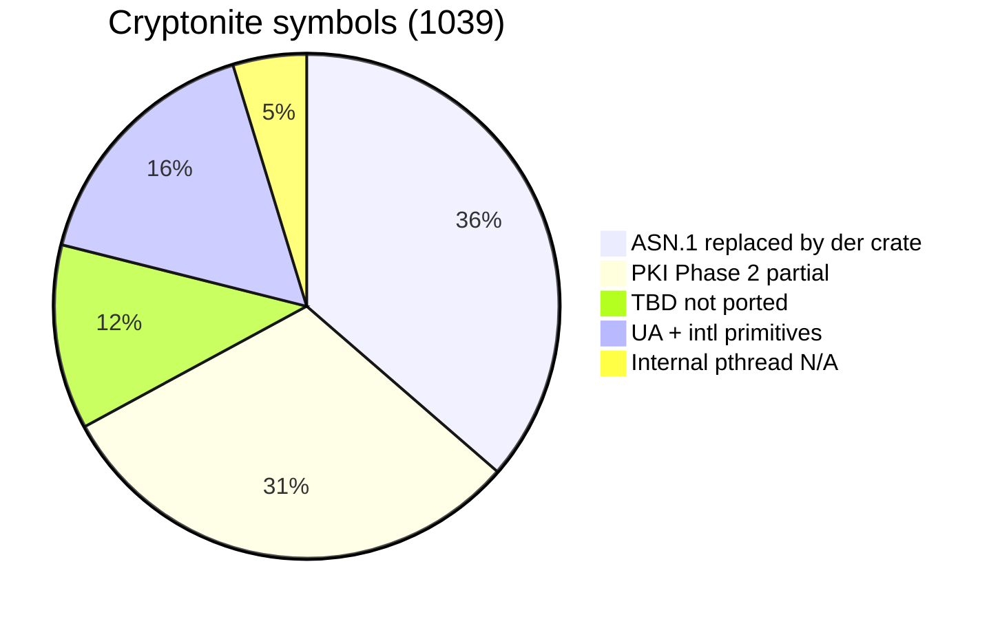

# Cryptonite parity overview

> **Languages:** English · [Українська](uk/CRYPTONITE_PARITY.md)

How much of [Cryptonite](https://github.com/privat-it/cryptonite) functionality uacryptex covers today, and what remains.

**Related:** [API_INVENTORY.md](API_INVENTORY.md) (symbol-by-symbol map), [CERTIFICATION.md](CERTIFICATION.md) (compliance matrix), [ROADMAP.md](ROADMAP.md) (timeline).

Cryptonite C sources under `../cryptonite/` are the **KAT oracle** during migration — uacryptex does not link Cryptonite at runtime.

## Summary

uacryptex covers **most practical Cryptonite functionality for Ukrainian PKI**, but it is **not a drop-in replacement** for the Cryptonite C SDK (~1039 exported symbols). The port uses a different architecture: pure Rust core + a small stable C ABI (~44 entry points) and high-level bindings (Go, Python, PHP, Node.js).

| Coverage level | Approx. | Meaning |
|----------------|---------|---------|
| **Public C / FFI API** | ~4% of Cryptonite symbols | Intentional: `SignCMS`, `EnvelopCMS`, `OpenPKCS12`, … — not a 1:1 port of `cert_*`, `sdata_*`, `aid_*` |
| **Certified crypto + typical PKI workflows** | ~85–95% | What production UA PKI applications usually need |
| **Full Cryptonite C SDK parity** | ~30–40% (estimate) | Hundreds of low-level pkix helpers and object managers still missing |

**Timeline:** full parity is estimated at **12–15 months** (2–3 FTE) in [ROADMAP.md](ROADMAP.md). The MVP vertical slice (sign → CMS → verify → PKCS#12) is already working.

## Symbol inventory breakdown

Auto-generated from `../cryptonite/src/**/*.h` — see [API_INVENTORY.md](API_INVENTORY.md).

| Metric | Value |
|--------|------:|
| Cryptonite exported symbols (unique) | 1039 |
| Stable uacryptex C ABI entry points | ~44 |
| Go module | `github.com/itcrow/uacryptex` |

### By Cryptonite module

| Module | Symbols | uacryptex target | Notes |
|--------|--------:|------------------|-------|
| `pkix/` | 602 | `uacryptex-core::pki` | Engines + high-level API; not every low-level accessor |
| `cryptonite/` | 217 | `uacryptex-core::primitives` | UA standards ported; international → RustCrypto |
| `asn1/` | 153 | `der` / `x509-*` crates | **Not ported 1:1** — replaced by Rust ecosystem |
| `storage/` | 57 | `uacryptex-core::storage` | PKCS#8 / PKCS#12 largely complete |
| `pthread/` | 10 | — | Replaced by `std::sync` |

### By migration strategy (symbol table)

| Strategy | Symbols | Status |
|----------|--------:|--------|
| skip — use `der` crate | 378 | N/A (different ASN.1 stack) |
| Phase 2 — pkix | 319 | Partial — engines exist, many helpers TBD |
| TBD | 123 | Not yet mapped / ported |
| RustCrypto | 88 | International primitives via RustCrypto |
| Phase 1 — UA primitives | 82 | Largely complete (KAT vs Cryptonite) |
| internal utilities | 39 | Replaced by Rust idioms |
| N/A — `std::sync` | 10 | Threading layer not ported |

## What is covered well

Evidence: KAT suites under `crates/uacryptex-core/tests/`, integration test `pki_example`, [CERTIFICATION.md](CERTIFICATION.md).

### Cryptographic primitives

| Area | Status | Evidence |
|------|--------|----------|
| DSTU 4145 sign / verify / DH / keygen | ✅ | `dstu4145_kat.rs`; curves M163…M431 |
| Kupyna (DSTU 7564) | ✅ | `dstu7564_kat.rs` |
| Kalyna (DSTU 7624) | ✅ | `dstu7624_kat.rs` (ECB, CBC, CTR, CFB, OFB, CMAC, XTS, KW, GMAC, GCM, CCM) |
| GOST 28147, GOST 34.311 PRNG | ✅ | `gost_kat.rs` |
| AES / SHA / RSA / ECDSA | ✅ | `intl_kat/` via RustCrypto |
| GOST R 34.10-94 | 🟡 optional | `--features legacy-gost3410`; deprecated |

### PKI and protocols

| Area | Status | Notes |
|------|--------|-------|
| X.509 parse / verify, SPKI | ✅ | `cert_kat.rs` |
| CMS SignedData (CAdES-BES) | ✅ | `cms_kat.rs`; Go `SignCMS` / `VerifyCMS` |
| CAdES-T / C / X / LT / A | ✅ | FFI + bindings |
| EnvelopedData | ✅ | GOST28147-CFB + Kalyna-GCM 128/256/512 |
| OCSP request / response | ✅ | engines + KAT |
| TSP request / response | ✅ | engines + KAT |
| CRL verify + issue | ✅ | `crl_kat.rs`, `crl_engine_kat.rs` |
| CSR, certificate issuance | ✅ | engines; CSR subset 🟡 for some key types |
| PKCS#12 (DSTU), PKCS#8 | ✅ | `pkcs12_kat.rs`, `pkcs8` |

### Integration scenarios

| Scenario | Cryptonite | uacryptex |
|----------|------------|-----------|
| `pkiExample` main path (M257 PB) | ✅ | ✅ `tests/pki_example.rs` |
| MVP vertical slice | demo | ✅ Rust + Go `TestMVP` |
| Multi-language bindings | N/A | ✅ Go, Python, PHP, Node.js on same FFI |

## Advantages over Cryptonite

uacryptex is **not a universally better replacement** for Cryptonite — see [Partial coverage and gaps](#partial-coverage-and-gaps) and [Where Cryptonite remains stronger](#where-cryptonite-remains-stronger). In several dimensions it **goes beyond** or is **more convenient** than the legacy C library.

### Protocol features

| Feature | Cryptonite | uacryptex |
|---------|------------|-----------|
| **Kalyna-GCM in CMS EnvelopedData** | GOST28147-CFB only in pkix enveloped engines | GOST28147-CFB + Kalyna-128/256/512-GCM (AEAD); same DSTU4145 DH + GOST28147-Wrap |
| **CAdES-T / LT / A (one-call API)** | TSP engines exist; `pkiExample` demonstrates BES/C/X — LT/A not exposed as high-level sign helpers | `SignCmsCadesT`, `SignCmsCadesLT`, `SignCmsCadesA` via FFI and all bindings |

Kalyna at the **primitive** level exists in both libraries; the uacryptex addition is **CMS content encryption** with Kalyna-GCM OIDs, not a new block cipher implementation.

### Integration and developer experience

| Area | uacryptex advantage |
|------|---------------------|
| **Language bindings** | Official Go, Python, PHP, Node.js on one stable FFI — [BINDINGS.md](BINDINGS.md), [CLIENT_LIBRARIES.md](CLIENT_LIBRARIES.md) |
| **API surface** | ~44 high-level entry points vs ~1039 low-level C symbols |
| **Go ecosystem** | `PrivateKey` implements [`crypto.Signer`](https://pkg.go.dev/crypto#Signer) |
| **Examples** | `go/examples/sign-document/`, `go/examples/demo/` walkthrough |
| **Distribution** | Prebuilt `native/lib/{os}/{arch}/`, CI matrix (Linux / macOS / Windows × amd64 / arm64) — [ARCHITECTURE.md](ARCHITECTURE.md) |

### Engineering and security posture

| Area | uacryptex advantage |
|------|---------------------|
| **Memory safety** | Pure Rust core; `#![forbid(unsafe_code)]` on `uacryptex-core` crate root |
| **Modern ASN.1 / PKI stack** | `der`, `x509-cert`, `cms`, `pkcs12` crates instead of asn1c object managers |
| **Hardening toolchain** | libFuzzer targets (`fuzz/`), Miri CI, benchmarks — [SECURITY.md](SECURITY.md) |
| **Reproducible releases** | Documented auditable build recipe — [REPRODUCIBLE_BUILD.md](REPRODUCIBLE_BUILD.md) |
| **Legacy GOST 34.10-94** | Off by default (`legacy-gost3410` feature); deprecated for new UA PKI |
| **Optional CT hardening** | `--features ct-scalar-mul` for DSTU4145 scalar multiplication — [CT_REVIEW.md](CT_REVIEW.md) |

Constant-time and formal side-channel evaluation are **not finished** — optional CT features do not replace Cryptonite's accredited evaluation history.

### When uacryptex is the better fit

Choose uacryptex when you need:

- modern integration in **Go / Python / PHP / Node.js** backends;
- **Kalyna-GCM** for enveloped documents;
- **CAdES-T / LT / A** without hand-assembling CMS attributes;
- cross-platform **FFI + bindings** out of the box;
- a memory-safe core and contemporary CI / fuzz / reproducible-build workflow.

### Where Cryptonite remains stronger

| Area | Cryptonite | uacryptex |
|------|------------|-----------|
| **Accredited certification (ДССЗЗІ)** | ✅ certified product history | ❌ KAT parity only — [CERTIFICATION.md](CERTIFICATION.md) |
| **Low-level C SDK** | Full `cert_*`, `sdata_*`, `aid_*`, object managers | Engines + high-level FFI |
| **Production maturity** | Long track record in certified deployments | Younger project |
| **Exotic PKIX/CMS control** | Fine-grained accessors for custom flows | Subset; many pkix helpers still TBD |

Choose Cryptonite when you need a **certified drop-in C library** or **maximum low-level control** without rewriting integration code.

## Partial coverage and gaps

### Intentionally not ported

- **ASN.1 layer** (378 symbols) — `asn1c` types replaced by the `der` crate and `x509-cert` / `cms` / `pkcs12` ecosystem.
- **Internal utilities** (`ba_*`, error context) and **pthread** — Rust standard library and idiomatic error types.

### Low-level pkix API (~300+ Phase 2 symbols)

Cryptonite exposes fine-grained C managers: `aid_*`, `cert_*`, `sdata_*`, `cinfo_*`, `esigner_*`, `eenvel_*`, … uacryptex replaces these with **engines** and the stable FFI surface documented in [FFI.md](FFI.md). Applications that call Cryptonite object managers directly must be rewritten against the new API.

### TBD (~123 symbols)

Mostly low-level CMS / OCSP / EnvelopedData accessors (`sdata_*`, `cinfo_*`, `ocspresp_*`), `crypto_cache_*`, and a few legacy helpers (e.g. DES3).

### Known functional gaps

| Gap | Status | Reference |
|-----|--------|-----------|
| CAdES-X-L Type 1/2 | ✅ | `build_content_info_cades_xl_type1` / `_type2`; Go `SignCmsCadesXLType1/2` |
| DSTU X.509 extensions (full set) | ✅ | `ext_create_crl_id`, `exts_*`, `creq_get_ext_by_oid`; `ext_kat.rs` (28 tests) |
| ONB-basis DSTU4145 verify (low-level) | 🟡 PB via FFI only | `uacryptex_dstu4145_verify_pb` |
| Constant-time EC private ops | 🟡 optional feature | [SECURITY.md](SECURITY.md), [CT_REVIEW.md](CT_REVIEW.md) |
| Formal ДССЗЗІ certification of uacryptex | ❌ not yet | [CERTIFICATION.md](CERTIFICATION.md) |

## Practical guidance

### Migrating a typical UA PKI application

If the app uses Cryptonite for **signing, verification, CMS/CAdES, PKCS#12, OCSP/TSP, enveloped documents** — uacryptex is **ready for evaluation**. The `pkiExample` scenario passes in Rust integration tests and Go enveloped/CMS tests.

### Replacing Cryptonite as a C SDK drop-in

If the app depends on **Cryptonite's low-level C API** (`cert_alloc`, `sdata_sign`, `manager_*`, …) — coverage is **low**. Plan an integration rewrite around `uacryptex.h` and language bindings ([CLIENT_LIBRARIES.md](CLIENT_LIBRARIES.md)).

### Formal certification

Algorithmic evidence exists (KAT parity vs Cryptonite), but **uacryptex is not a certified product** until an accredited evaluation on a frozen release. See [CERTIFICATION.md](CERTIFICATION.md) and [REPRODUCIBLE_BUILD.md](REPRODUCIBLE_BUILD.md).

## Maintenance

Update this document when:

- A major Cryptonite module reaches parity or is explicitly marked out of scope
- uacryptex gains a protocol or integration advantage over Cryptonite (update [Advantages over Cryptonite](#advantages-over-cryptonite))
- The stable FFI surface grows (regenerate [API_INVENTORY.md](API_INVENTORY.md) via `scripts/generate-api-inventory.sh`)
- Certification or roadmap milestones change
